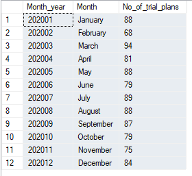

🍜 Case Study #1: Danny's Diner


## 📚Table of Contents

1. Business Task  
2. Entity Relationship Diagram  
3. Question and Solution
## Business Task

Danny wants to use the data to answer a few simple questions about his customers, especially about their visiting patterns, how much money they’ve spent and also which menu items are their favourite.

## Entity Relationship Diagram


## Question and Solution

1. What is the total amount each customer spent at the restaurant?

**Query #1**

    SELECT
      	product_id,
        product_name,
        price
    FROM dannys_diner.menu
    ORDER BY price DESC
    LIMIT 5;

| product_id | product_name | price |
| ---------- | ------------ | ----- |
| 2          | curry        | 15    |
| 3          | ramen        | 12    |
| 1          | sushi        | 10    |

---

2. How many days has each customer visited the restaurant?
```
SELECT YEAR(start_date) * 100 + MONTH(start_date) Month_year,  
		DATENAME(MONTH, start_date) Month,  
		COUNT(DISTINCT customer_id) No_of_trial_plans  
FROM foodie_fi.subscriptions s  
WHERE s.plan_id = 0  
GROUP BY YEAR(start_date) * 100 + MONTH(start_date),  
		DATENAME(MONTH, start_date)  
ORDER BY YEAR(start_date) * 100 + MONTH(start_date)  
```



3. 

